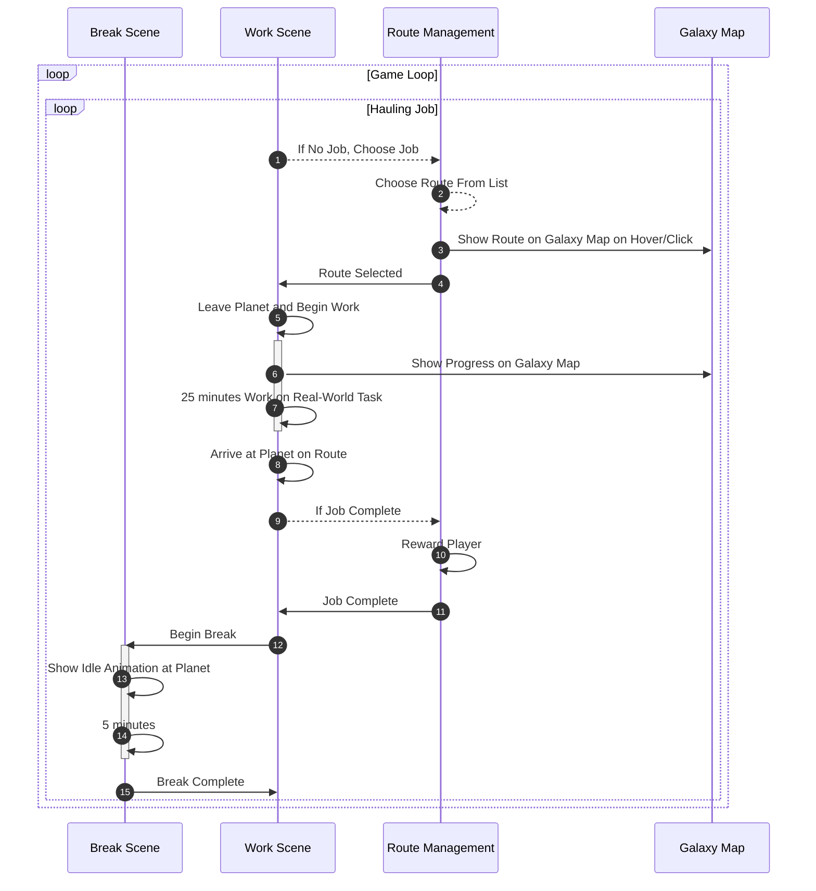
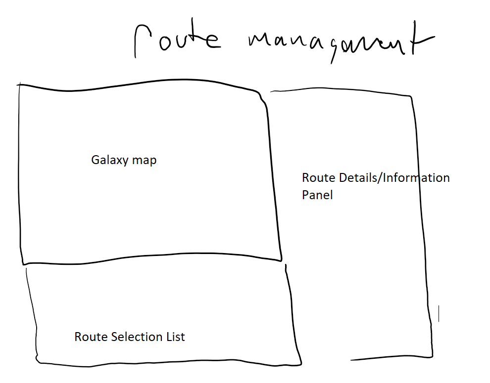
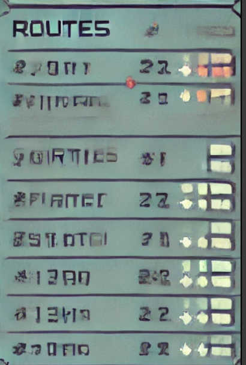
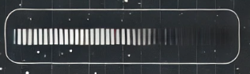
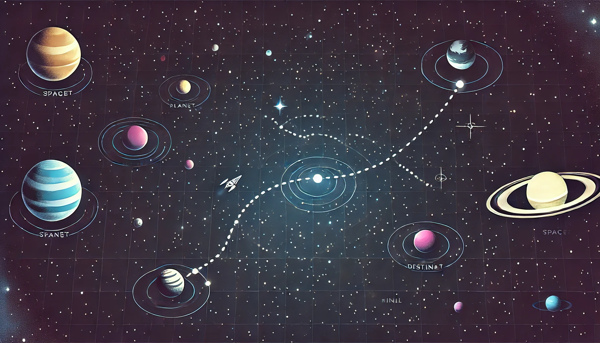
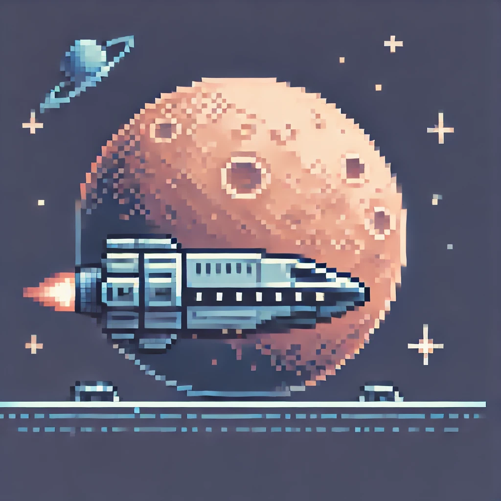

### What is pomodoro?

The Pomodoro Technique is a time-management method where you work in focused intervals (usually 25 minutes), called "Pomodoros," followed by short breaks (5 minutes). After completing four Pomodoros, you take a longer break (15-30 minutes). The technique is designed to improve productivity by breaking work into manageable intervals and providing regular breaks to prevent burnout.

### Concept/Theme:

The game is a **pomodoro-based spaceship simulator** that blends productivity with gameplay. Players take on the role of a space hauler, choosing jobs and following routes across space, similar to **Euro Truck Simulator 2**. During the pomodoro work intervals, the spaceship travels along a mapped route, while during the break intervals, the ship automatically stops at planets for refueling and waits for clearance to continue. When picking out a job, players will see a list of things to haul and when selecting from the list, they will see the route the ship will take. Each job will have a different number of work/break cycles to complete. The purpose of having different jobs is to give the player a sense of progression and variety in their tasks. Additionally, you can decide to take a job that will take 4 cycles to complete and that may line up with roughly how long you even want to spend on what you're really doing besides the game.

### Brief Mechanic Intro:

The **unique gameplay mechanic** is the **pomodoro timer** and it's pairing with a **route management system**. 

While keeping in line with the asyncronous nature of the pomodoro technique, The player selects a job and the ship follows a predetermined route while they focus on real-world tasks. The game then transitions into the break phase, where the ship automatically stops at planets for "refueling."

# Pomodoro-based Spaceship Simulator



### Core Gameplay Loop:
- **Work Phase (25 minutes)**: 
  - *If the player hasn't selected a job:* The player selects a job and the spaceship follows a route on the galaxy map. 
    - The **routes** are of **varying lengths and complexity**, with different planets to stop at. e.g., a short route might have 1-2 planets, while a long route might have 4-5 planets. Each planet represents a break interval. This is to give the player a sense of progression and variety in their tasks.
  - The player focuses on real-world tasks during this phase while the spaceship travels and mirrors their efforts.
  - The player can see the ship's progress on the galaxy map and receive **notifications** when the work phase is complete.
  - When the ship arrives at a planet, the player's ship will idle at the planet on the galaxy map.
- **Break Phase (5 minutes)**:
  - The spaceship automatically stops at planets during the break phase.
  - The player can take a break, relax, and prepare for the next work phase.
  - The player receives **notifications** when the break phase is complete.

### Route Management:

Route Previews: Showing the path and break points for the route on hover/click.
Route Details: Displaying the route's name, distance, break points, and estimated time to complete.

### Route Selection List:


### Scene Layouts:
#### Work Phase:
```
+--------------------------------------+
|        subtle visual timer           |
+--------------------------------------+
|                                      |
|        Expanded Galaxy Map           |
|                                      |
+--------------------------------------+
|                                      |
|       Collapsable details panel      |
|                                      |
+--------------------------------------+
```
### Subtle Visual Timer:

- A subtle visual timer at the top of the screen to indicate the remaining time in the work phase. Non-intrusive and easy to glance at while focusing on real-world tasks. Will show analog clock with time remaining when hovered over.

### Expanded Galaxy Map:

- A 2D galaxy map with a zoomed-out perspective. The map features tiny planets scattered across a dark space background filled with stars. A drawn route shows the spaceship's path and the planets it will stop at during the work phase.
- Mouse hover on planets will show names.
- Hover over path near ship will adjust the animation of the ship following the path in a reactive way.
- The line between the planets will be drawn with a dashed line to show the path and the path already traveled will be solid.

#### Break Phase:

```
+--------------------------------------+
|                                      |
|        Idle Animation at Planet      |
|                                      |
|                                      |
+--------------------------------------+
|                                      |
|        subtle visual timer           |
|                                      |
+--------------------------------------+
```

### Idle Animation at Planet:
 - The spaceship will idle at the planet, with subtle animations of it hovering. 
 - Mouse movement over the planet will trigger visual effects like small stars or particles.
 - Ship will extremely slightly impulse away from cursor when hovered over.



### Target Audience:

This game is designed for **gamers and productivity enthusiasts** who enjoy simulation games like Euro Truck Simulator 2 but also want to integrate productivity tools like the pomodoro technique. The target audience are people who appreciate the mix of casual simulation and time management. They are likely to have some familiarity with time-management tools and might already be interested in enhancing their productivity while gaming or working on various projects.

### Visual Design:

The visual style of the game will be a simple, minimalist space theme, inspired by **Starbound** with a focus on space exploration without internal ship designs. The spaceship's design will be **side-scrolling**, and during breaks, players can see planets as interactive(mouse visual effects) stopping points. For the ships, various designs will be procedurally generated using a tool like DALL-E, keeping the visual style cohesive and futuristic but straightforward. Colors will be muted and calm, with clear visuals for planets, routes, and alerts to avoid distractions from the pomodoro focus.

### Scope of Demo:

The demo will focus on the core **pomodoro-based route mechanic**. It will include:

- A basic spaceship following a route during work intervals. The player can select a job and ship will travel along a star map.
- Automatic stopping at planets during breaks, with a simple idle animation.
- Generate some json with fake data for the route items and planets.
- A simple timer to indicate the work and break intervals.
- A basic galaxy map with a drawn route and planets.
- A simple UI for selecting jobs and viewing route details.

### Disclaimer:
Chatgpt used for diagrams and reformatting.